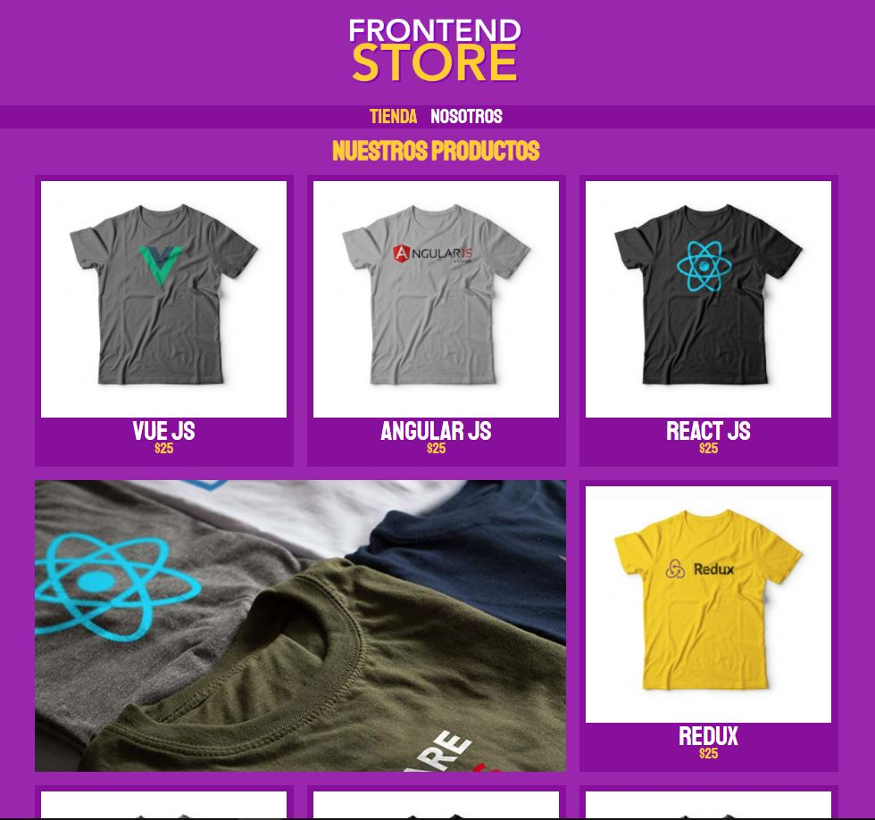
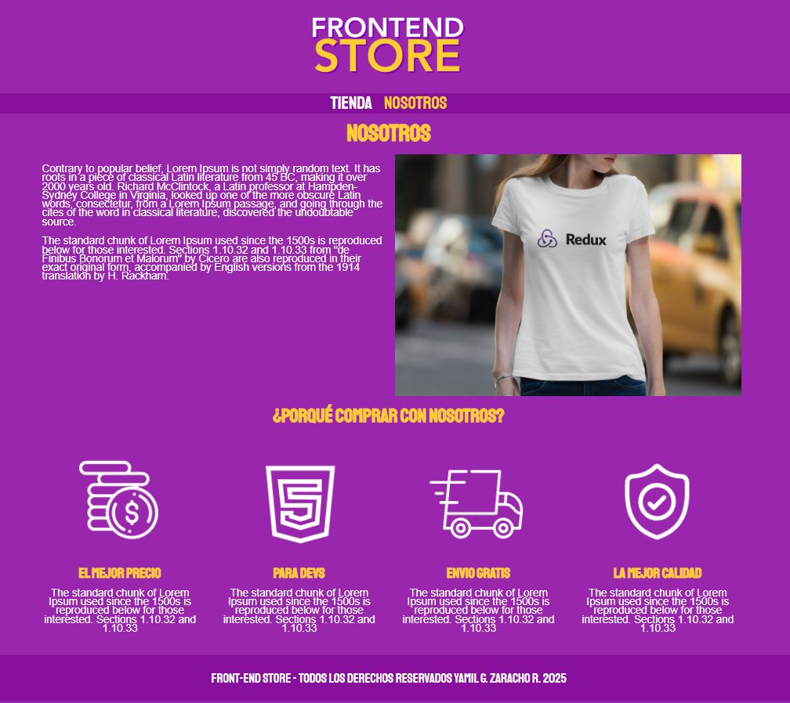
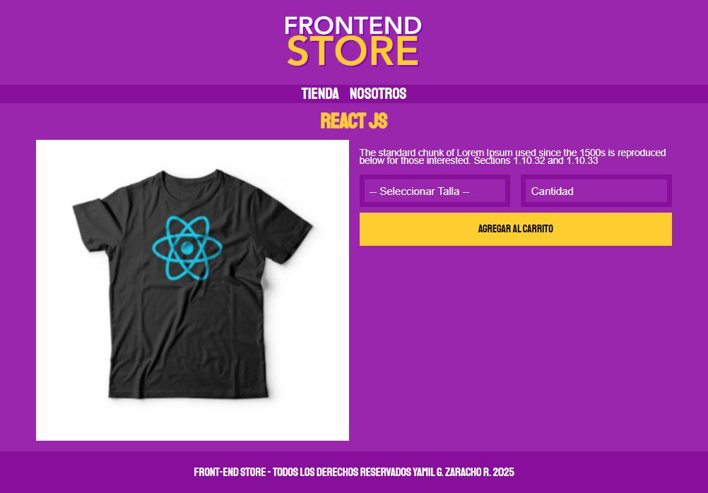

# FrontEndStore

Este proyecto es una tienda virtual de ejemplo construida con HTML y CSS. Incluye múltiples páginas como inicio, producto y sobre nosotros. Es ideal para practicar diseño responsivo, estructura de layouts, y presentación visual de productos.

## 🚀 Tecnologías utilizadas

- HTML5
- CSS3 (con Normalize.css)
- Diseño responsivo
- Imágenes optimizadas

## 📁 Estructura del proyecto
proyecto2_FrontEndStore/ ├── index.html ├── nosotros.html ├── producto.html ├── css/ │ ├── normalize.css │ └── style.css ├── img/ │ ├── [múltiples imágenes de productos, íconos y gráficas]

## 📷 Capturas de pantalla

### Página de inicio


### Página de producto


### Página de producto


## 🧩 Funcionalidades

- Página de inicio con productos destacados
- Página informativa sobre la tienda
- Página de detalle del producto
- Diseño adaptable a móviles y tablets

## 🛠️ Cómo usar

1. Clona el repositorio:
   ```bash
   git clone https://github.com/tu-usuario/frontend-store.git
   Abre index.html en tu navegador favorito.

## 💡 Autor
    Desarrollado por Yamil G. Zaracho R. (YamilGZ).